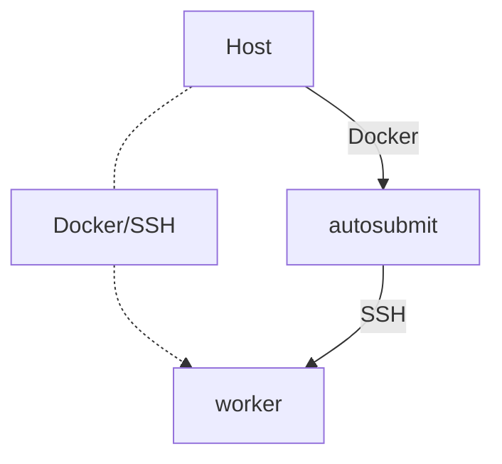
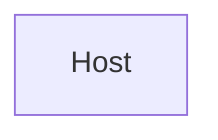
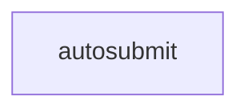
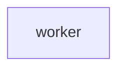

# Autosubmit Docker Cluster

All the files and directories created must be placed in the same base directory.



Workflows will be run from both the Host node and from the Autosubmit node.
The platform `local` will be configured to use the `worker` node via SSH.
The dotted line in the graph above shows that it is optional to interact with
Autosubmit from the host node (i.e. it could be a Windows machine without
Autosubmit, connected to the `autosubmit` container running workflows using
the cluster).

## Host prerequisites



1. A host computer with Docker (e.g. Ubuntu Linux LTS, Docker version 20.10.18, build b40c2f6;
2. `docker-compose` (e.g. docker-compose version 1.23.1, build b02f1306);
3. Autosubmit pre-installed in the host computer (not a strong requirement, as you could use
the `autosubmit` container exclusively, but it tests more of the system that way; must be the
same version as in the rest of the cluster, e.g. v3.14.0);
4. Autosubmit configured correctly (i.e. `configure` and `install` executed);
5. An Autosubmit workflow created (e.g. `autosubmit expid -H local -d "Docker example"`, we
assume the workflow created is called “`a000`”, change it if needed);
7. The workflow must have its platform correctly set up for the Docker example (more below).

_`platforms_a000.conf`_

```ini
[local]
TYPE = ps
HOST = worker
USER = autosubmit
PROJECT = test
TEMP_DIR = /tmp
SCRATCH_DIR = /tmp
```

## Autosubmit container



This container will be called `autosubmit` and contains the `autosubmit` command.
It is the equivalent to a virtual machine with Autosubmit used to submit workflows.

The `Dockerfile` for Autosubmit, based on Airflow (thanks!). This file can be saved
somewhere, like `autosubmit/docker/` (i.e. inside the Autosubmit checked out source
code). If saved in a non-empty directory, remember to keep the context to a minimum
(i.e. use a `.dockerignore` file for security and performance):

_`Dockerfile`_

<details>
<summary>Click to expand</summary>

```docker
# syntax=docker/dockerfile:1.4
#
# Copyright (C) 2022
#
# This program is free software: you can redistribute it and/or modify
# it under the terms of the GNU General Public License as published by
# the Free Software Foundation, either version 3 of the License, or
# (at your option) any later version.
#
# This program is distributed in the hope that it will be useful,
# but WITHOUT ANY WARRANTY; without even the implied warranty of
# MERCHANTABILITY or FITNESS FOR A PARTICULAR PURPOSE.  See the
# GNU General Public License for more details.
#
# You should have received a copy of the GNU General Public License
# along with this program.  If not, see <http://www.gnu.org/licenses/>.

# Used bits of old images written, as well as the airflow (Apache License 2) production
# Docker image. Credits to the Airflow team.
# Note that ALv2 and GPLv3 are compatible for this case:
# https://www.apache.org/licenses/GPL-compatibility.html
# Also giving back to Airflow; little but hopefully shows some appreciation
# for their work: https://github.com/apache/airflow/pull/24397 :^)

# Note: Always review if they changed anything in the Docker best practices document;
#       https://docs.docker.com/develop/develop-images/dockerfile_best-practices/

ARG AUTOSUBMIT_USER=autosubmit
ARG AUTOSUBMIT_USER_HOME_DIR=/home/autosubmit
ARG AUTOSUBMIT_BRANCH=master
ARG AUTOSUBMIT_GIT_REPOSITORY=https://earth.bsc.es/gitlab/es/autosubmit.git
ARG AUTOSUBMIT_UID=2000
ARG AUTOSUBMIT_GID=2000

ARG PYTHON_BASE_IMAGE="python:2.7.18-slim-buster"

##############################################################################################
# Base image. We can create scripts and other requirements in this base image.
##############################################################################################

FROM scratch as base-image

##############################################################################################
# Autosubmit build image. This will be larger, our workbench to create the container.
# We will discard most of the content here, keeping only the necessary for autosubmit
# in another layer.
##############################################################################################

FROM ${PYTHON_BASE_IMAGE} as autosubmit-build-image

ARG AUTOSUBMIT_USER_HOME_DIR
ARG AUTOSUBMIT_GIT_REPOSITORY
ARG AUTOSUBMIT_BRANCH
ARG AUTOSUBMIT_UID
ARG AUTOSUBMIT_GID

ARG PYTHON_BASE_IMAGE
ENV PYTHON_BASE_IMAGE=${PYTHON_BASE_IMAGE} \
    DEBIAN_FRONTEND=noninteractive LANGUAGE=C.UTF-8 LANG=C.UTF-8 LC_ALL=C.UTF-8 \
    LC_CTYPE=C.UTF-8 LC_MESSAGES=C.UTF-8

ARG DEV_APT_DEPS="\
  apt-transport-https \
  apt-utils \
  git"

# Copy anything from the base image
# e.g. COPY --from=base-image setup.sh /opt/.../

ENV DEV_APT_DEPS=${DEV_APT_DEPS}

# System dependencies layer
RUN apt-get update && \
    apt-get install -y --no-install-recommends \
      ${DEV_APT_DEPS} && \
    apt-get autoremove -yqq --purge && \
    apt-get clean && \
    rm -rf /var/lib/apt/lists/*

# Container user
RUN groupadd -g "${AUTOSUBMIT_GID}" autosubmit && \
    adduser --gecos "First Last,RoomNumber,WorkPhone,HomePhone" --disabled-password \
      --quiet "autosubmit" --uid "${AUTOSUBMIT_UID}" --gid "${AUTOSUBMIT_GID}" --home "${AUTOSUBMIT_USER_HOME_DIR}" && \
    mkdir -pv "${AUTOSUBMIT_USER_HOME_DIR}" && \
    chown -R "autosubmit:autosubmit" "${AUTOSUBMIT_USER_HOME_DIR}" && \
    chmod -R g+rw "${AUTOSUBMIT_USER_HOME_DIR}"

USER autosubmit
WORKDIR ${AUTOSUBMIT_USER_HOME_DIR}

# Autosubmit layer
# TODO: requests is a transitive dependency, but apparently not listed in Autosubmit's
#       install_requires dependencies list.
RUN pip install --no-cache-dir --user --upgrade pip && \
    pip install --no-cache-dir --user requests && \
    pip install --no-cache-dir --user git+${AUTOSUBMIT_GIT_REPOSITORY}@${AUTOSUBMIT_BRANCH}

# At this point, autosubmit must be installed and available from ~/.local/site-packages/...

##############################################################################################
# Actual Autosubmit image, much smaller than the build image.
##############################################################################################

FROM ${PYTHON_BASE_IMAGE} as main

# TODO: update labels later...
LABEL maintainer="Bruno P. Kinoshita"

ARG AUTOSUBMIT_USER_HOME_DIR
ARG AUTOSUBMIT_BRANCH
ARG AUTOSUBMIT_UID
ARG AUTOSUBMIT_GID
ARG PYTHON_BASE_IMAGE

ENV PYTHON_BASE_IMAGE=${PYTHON_BASE_IMAGE} \
    DEBIAN_FRONTEND=noninteractive LANGUAGE=C.UTF-8 LANG=C.UTF-8 LC_ALL=C.UTF-8 \
    LC_CTYPE=C.UTF-8 LC_MESSAGES=C.UTF-8

RUN apt-get update && \
    apt-get install -y --no-install-recommends \
      git \
      graphviz \
      ssh \
      sqlite3 && \
    apt-get autoremove -yqq --purge && \
    apt-get clean && \
    rm -rf /var/lib/apt/lists/*

ENV PATH="${AUTOSUBMIT_USER_HOME_DIR}/.local/bin:${PATH}" \
    AUTOSUBMIT_UID=${AUTOSUBMIT_UID} \
    AUTOSUBMIT_GID=${AUTOSUBMIT_GID} \
    AUTOSUBMIT_USER_HOME_DIR=${AUTOSUBMIT_USER_HOME_DIR} \
    AUTOSUBMIT_BRANCH=${AUTOSUBMIT_BRANCH}

# Container user
RUN groupadd -g "${AUTOSUBMIT_GID}" autosubmit && \
    adduser --gecos "First Last,RoomNumber,WorkPhone,HomePhone" --disabled-password \
      --quiet "autosubmit" --uid "${AUTOSUBMIT_UID}" --gid "${AUTOSUBMIT_GID}" --home "${AUTOSUBMIT_USER_HOME_DIR}" && \
    mkdir -pv "${AUTOSUBMIT_USER_HOME_DIR}" && \
    mkdir -pv "${AUTOSUBMIT_USER_HOME_DIR}/autosubmit" && \
    chown -R "autosubmit:autosubmit" "${AUTOSUBMIT_USER_HOME_DIR}" && \
    chmod -R g+rw "${AUTOSUBMIT_USER_HOME_DIR}" && \
    find "${AUTOSUBMIT_USER_HOME_DIR}" -executable -print0 | xargs --null chmod g+x

COPY --from=autosubmit-build-image --chown=autosubmit:autosubmit \
     "${AUTOSUBMIT_USER_HOME_DIR}/.local" "${AUTOSUBMIT_USER_HOME_DIR}/.local"

ENTRYPOINT ["autosubmit"]
```
</details>

The Docker `autosubmit` container will need its own `.autosubmitrc` file, as that RC
file specifies file locations that vary for each server:

_`.autosubmitrc`_

```rc
[database]
path = /home/autosubmit/autosubmit
filename = autosubmit.db

[local]
path = /home/autosubmit/autosubmit

[globallogs]
path = /home/autosubmit/autosubmit/logs

[structures]
path = /home/autosubmit/autosubmit/metadata/structures

[historicdb]
path = /home/autosubmit/autosubmit/metadata/data

[historiclog]
path = /home/autosubmit/autosubmit/metadata/logs

[autosubmitapi]
url = http://127.0.0.1:8081 # Replace me?
```

## SSH worker



This is a worker node. It is an Alpine based Linux that comes with SSH
and is very customizable. In real life this worker node would have a
batch system like Slurm installed, or contain GPU's, or the utilities
used by the tools executed in the Autosubmit workflow.

A Linux Server OpenSSH [docker image](https://github.com/linuxserver/docker-openssh-server).
The image by default uses port `2222`, which is an issue as Autosubmit
only supports the port `22` for all the Paramiko based platforms. We
can bypass it by customizing the initialization of the OpenSSH (instead
of doing something more complex like port-forwarding).

Create the file `./custom-cont-init.d/custom-port.sh`. The Linux Server
maintainers create images that load scripts in the `/custom-cont-init.d/`
folder. We will create a volume to bind our `custom-port.sh` to that
location later:

_`./custom-cont-init.d/custom-port.sh`_

```sh
#!/bin/bash

# Replace 22 with your custom port
sed -i -e 's/^USER_NAME=.*/USER_NAME=root/' -e 's/2222$/22/' /etc/services.d/openssh-server/run

# Source: https://github.com/linuxserver/docker-openssh-server/issues/30
```

We also need to create the directory used for the workflow platform. We can create
another file inside `./custom-cont-ini.d` for that:

_`./custom-cont-init.d/autosubmit-remote-init.sh`_

```sh
#!/bin/bash

# Every remote worker needs to have the project folder created.
# /tmp/ is the SCRATCH_DIR; test is the PROJECT; autosubmit is the USER.
mkdir -pv /tmp/test/autosubmit/
chown -R autosubmit: /tmp/test/
```

## Docker Compose cluster

This cluster uses the Linux Server OpenSSH worker node, and a container for Autosubmit.
Note that both containers **were created to be as ephemeral as possible**. This means that
they are not supposed to retain state, data, or any tools of importance, and can be
destroyed and replaced by new containers at any time (which is useful for cloud environments
like AWS, OpenStack, Kubernetes, etc.).

>**NOTE**: The whole cluster runs without `root` users and without using `sudo`, another
> Docker best practice. It also helps to migrate it to Singularity, charliecloud, etc.

The `docker-compose.yml` file below can be used without any [override files](https://docs.docker.com/compose/extends/)
(which can be used, if needed). And it also does not uses [replicas](https://docs.docker.com/compose/compose-file/deploy/)
(another possibility, if needed):

_`docker-compose.yml`_

<details>
<summary>Click to expand</summary>

```yaml
version: "3.7"
# Autosubmit example cluster.
services:
  # A worker node.
  worker:
    image: lscr.io/linuxserver/openssh-server:latest
    container_name: worker
    hostname: worker
    environment:
      - PUID=1000
      - PGID=1000
      - TZ=UTC
      # - PUBLIC_KEY=yourpublickey #optional
      # - PUBLIC_KEY_FILE=/path/to/file #optional
      # - PUBLIC_KEY_DIR=/path/to/directory/containing/_only_/pubkeys #optional
      # This is pulling my SSH keys from GitHub, just to make sure it never accesses
      # my local files in the container. The linuxserver image offers other
      # alternatives for fetching the SSH key.
      - PUBLIC_KEY_URL=https://github.com/kinow.keys #optional
      - SUDO_ACCESS=false #optional
      - PASSWORD_ACCESS=false #optional
      # - USER_PASSWORD=password #optional
      # - USER_PASSWORD_FILE=/path/to/file #optional
      - USER_NAME=autosubmit #optional
    volumes:
      - type: bind
        source: ./custom-cont-init.d
        target: /custom-cont-init.d
        read_only: true
    ports:
      - "2222:2222"
    restart: unless-stopped
  # Autosubmit server to submit experiments.
  autosubmit:
    container_name: autosubmit
    hostname: autosubmit
    build:
      context: .
      dockerfile: Dockerfile
      args:
        - AUTOSUBMIT_UID=1000
        - AUTOSUBMIT_GID=1000
        - AUTOSUBMIT_BRANCH=v3.14.0
    user: autosubmit
    # Just to keep the container running.
    entrypoint: "tail -f /dev/null"
    # N.B.: The autosubmit container can operate in isolation.
    # ports:
    depends_on:
      - worker
    # Here we define the SSH socket agent location.
    environment:
      - SSH_AUTH_SOCK=/ssh-agent
    volumes:
      # The .autosubmitrc configuration file, indicating where location
      # of files such as the SQLite database file.
      - type: bind
        source: ./.autosubmitrc
        target: /home/autosubmit/.autosubmitrc
        read_only: true
      # The directory that holds the Autosubmit experiments.
      - type: bind
        source: ${HOME}/autosubmit
        target: /home/autosubmit/autosubmit
        read_only: false
      # The SSH agent file, from the host. This prevents copying secrets like SSH keys inside the container.
      # e.g. https://dille.name/slides/2020-01-22/110_ecosystem/ssh_forwarding/slides.final/
      - type: bind
        source: ${SSH_AUTH_SOCK}
        target: /ssh-agent
        read_only: true
    restart: unless-stopped
```
</details>

There are two services defined in this Docker Compose file. One for Autosubmit,
using the `Dockerfile`. That container can be used as a permanent VM/container
to submit jobs (although users can also submit jobs locally directly to workers).

It uses a `tail -f /dev/null` entrypoint so that Docker Composer sees the container
as a permanent daemon (otherwise `autosubmit` default entrypoint would exit
immediately).

Volumes are bound to the Autosubmit container, as it is expected
