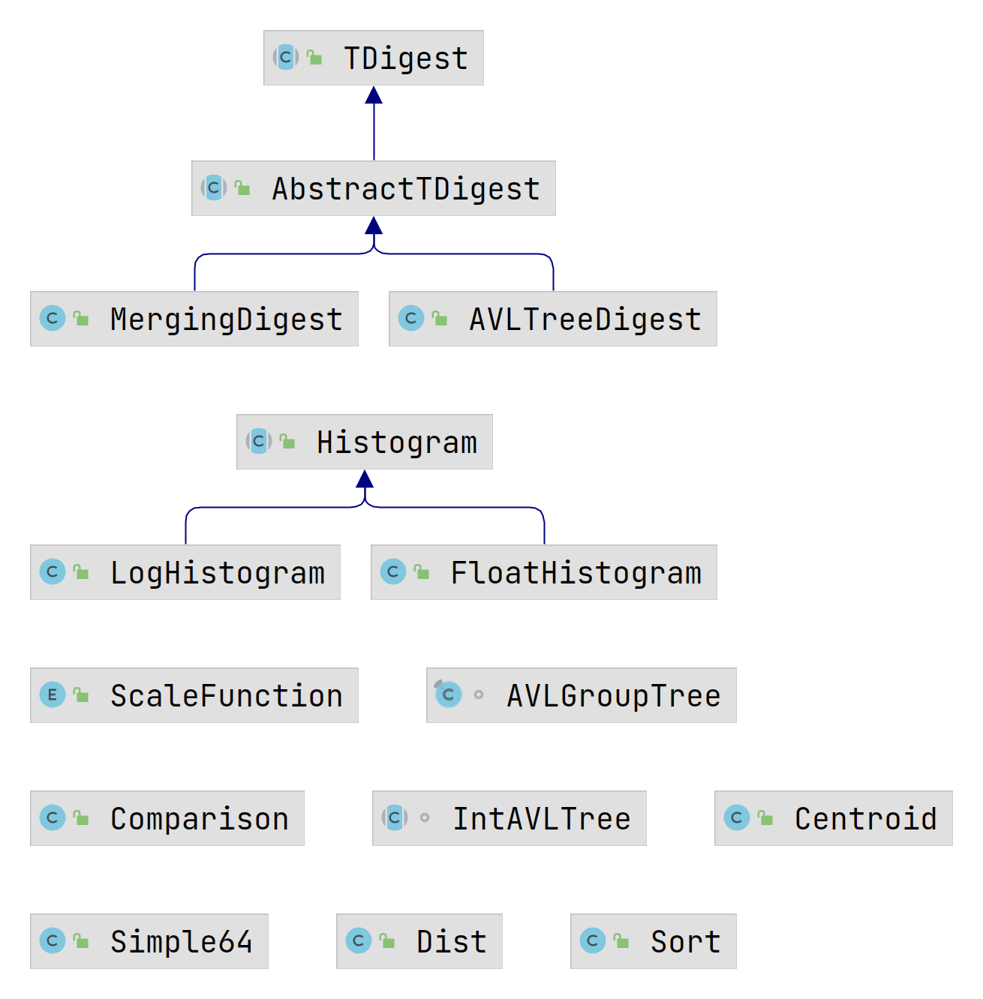
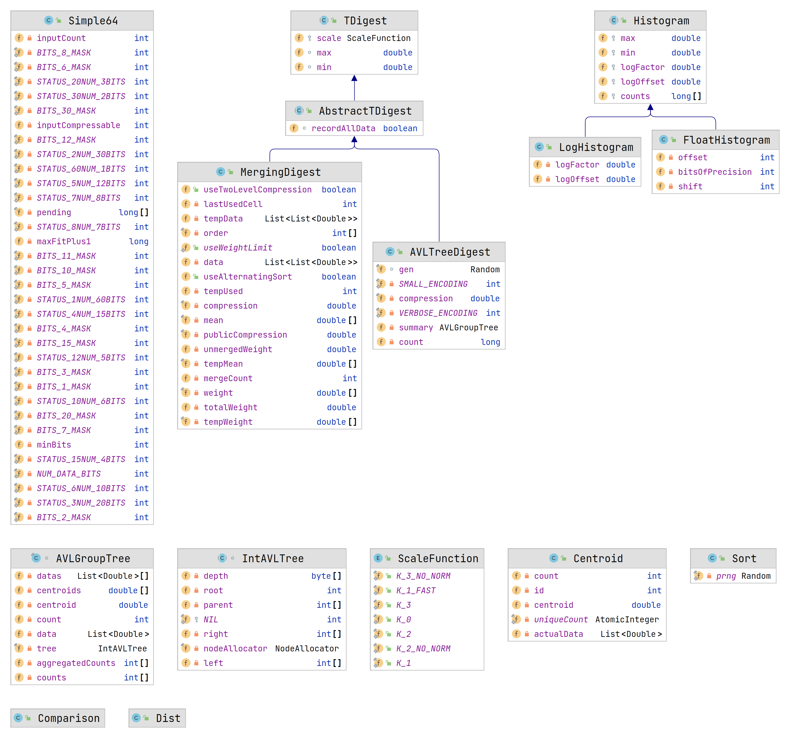
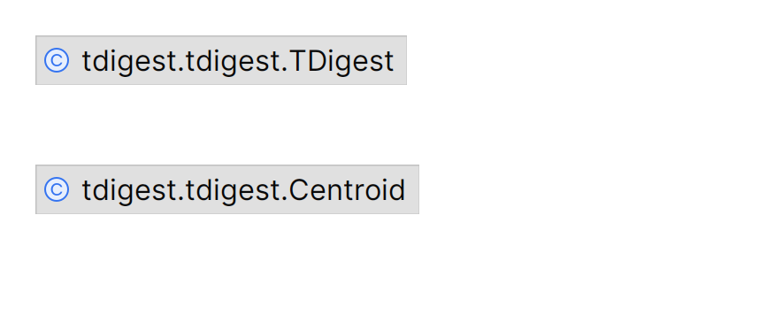
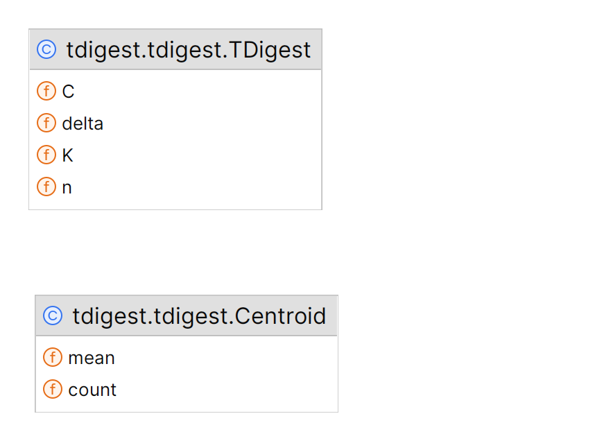

# t-digest: Java & Python implementations

## Java implementation

The original t-digest implementation is written in Java by
Ted Dunning: <https://github.com/tdunning/t-digest> (Apache License).





## Python implementation

The Python t-digest implementation used here is this one:
<https://github.com/CamDavidsonPilon/tdigest> (MIT License).





## Main differences

> WIP: first pass over the code, still pending practical comparison
>      to confirm the findings here.

### Backing data structures

The Java implementation has two t-digest types: `AVLTreeDigest`, and
`MergingDigest`, while the Python implementation has just one.

`AVLTreeDigest` uses an [AVL Tree](https://en.wikipedia.org/wiki/AVL_tree)
that has centroids as node values. Centroids are
[weighted averages](https://en.wikipedia.org/wiki/Weighted_arithmetic_mean).

`MergingDigest` has a comment on its Javadoc saying it's “generally
the best known implementation right now”. It accumulates points into
a buffer and occasionally sorts and merges these points into a sorted
array. It amortizes the sort-merge operation.

The Python implementation is more similar to the `AVLTreeDigest`. It
uses an `AccumulationTree` object as base data structure, from a
[Python library created especifically for this t-digest](https://github.com/tkluck/accumulation_tree),
that uses a [Red Black Tree](https://en.wikipedia.org/wiki/Red%E2%80%93black_tree)
modified to have partial aggregations as values (to speed up calculating
the sums of bins/segments). Red Black Trees are not strictly balanced,
with faster insertion, but slower search times than the AVL Tree,
so the Python library has probably some disadvantage for using
a Red Black Tree (it's also not clear if the complexity is the same
since it is a Red Black Tree modified to have aggregated values instead
of simple values as the textbook implementations).

### Application Programming Interface (API)

The interface and operations are not identical. With Java you would
call `add` to add another instance of t-digest, or to add a new `double`
value. With Python, it uses `__add__` to add another instance, and `update()`
to add a new `double` value.

The Java implementation also has more validation (like checking `min`, `max` values),
while the Python version skips it.

Both the Java and Python implementations support compression and calculating
the [cumulative distribution function (cdf)](https://en.wikipedia.org/wiki/Cumulative_distribution_function).

The Python implementation provides a `percentile` function, to compute the
100 quantiles. But the Java implementation provides a `quantile(d)` method,
where `d` is a double between `0` and `1`, used to create different quantiles.

> WIP: confirm the above.

#### Sample code

```java
public static void main(String[] args) {
    AVLTreeDigest tdigest = new AVLTreeDigest(3);
    tdigest.recordAllData();
    Random r = new Random(42);
    for (int i = 0; i < 100; i += 1) {
        tdigest.add(r.nextDouble() * 100);
    }
    System.out.printf("Min is %f, max is %f%n", tdigest.min, tdigest.max);
    System.out.printf("Count is %d, there are %d centroids%n", tdigest.count, tdigest.summary.size());
    for (Centroid c : tdigest.summary) {
        System.out.printf("Centroid %d, mean %f, data is %s%n", c.id(), c.mean(), c.data());
    }
}
```

### Maths.... other... precision... etc...

WIP
